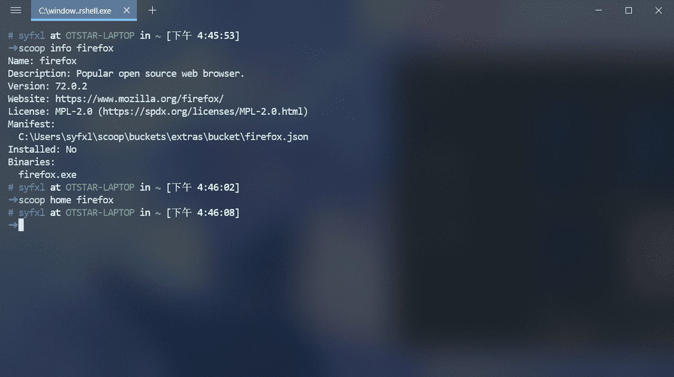
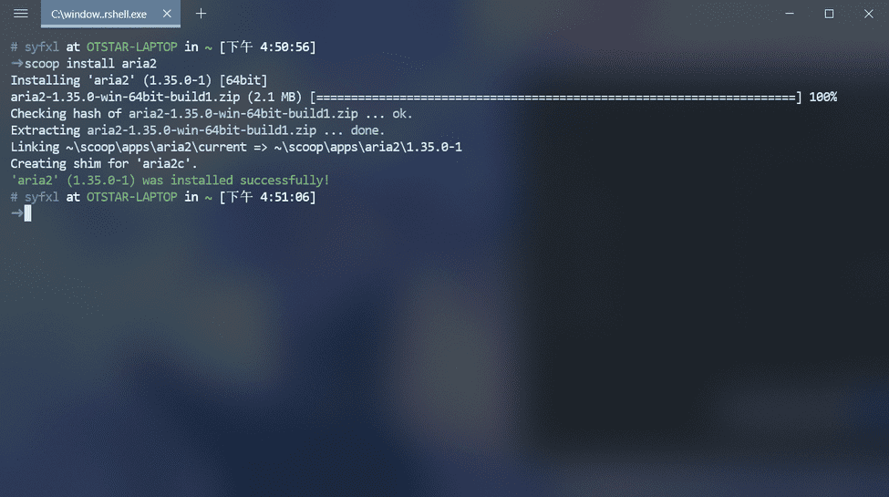
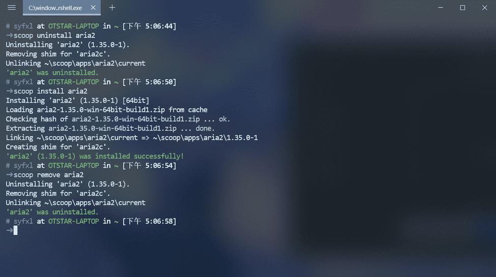
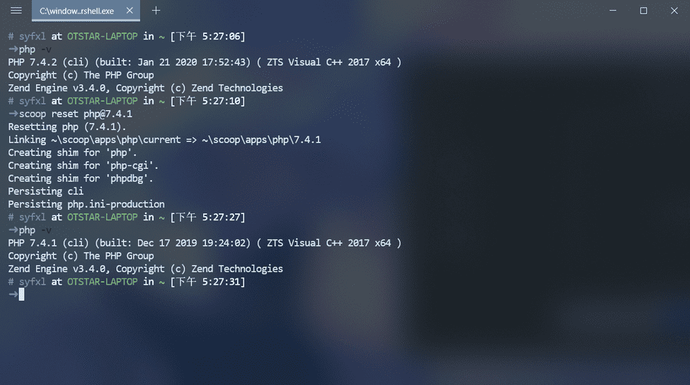
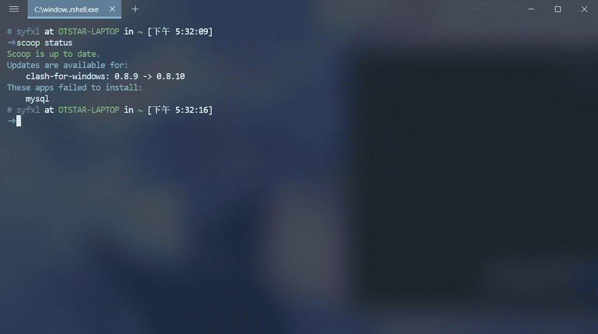

想必小伙伴们苦恼 Windows 下没有和 Ubuntu 等 Linux 下方便的包管理吧，不过经过较长时间的体验**我觉得 Scoop 可能是 Windows 上体验最好的「包管理器」**。

## 那么如何安装 Scoop 呢？

首先你需要打开 PowerShell ，然后输入以下命令允许执行本地脚本。

```powershell
Set-ExecutionPolicy -ExecutionPolicy RemoteSigned -Scope CurrentUser
```

然后运行以下命令安装 Scoop

```powershell
Invoke-Expression (New-Object System.Net.WebClient).DownloadString('https://get.scoop.sh')

# 或者使用短命令
iwr -useb get.scoop.sh | iex
```

静待脚本执行完成就可以了，安装成功后，让我们尝试一下：

```powershell
# 显示帮助
scoop help
```


这说明了 Scoop 安装成功了，通过 Scoop 安装的软件默认会位于 `C:\Users\<user>\scoop` 如果是安装到 `global` 环境的是 `C:\ProgramData\scoop`。

Scoop 安装成功后我们就可以利用它来安装其他软件了，Scoop 的命令和 Linux 下的包管理器非常类似都是「`scoop`+ 动作 + 对象」的语法，比较常用的动作主要是以下几种操作。

## Scoop 常用操作

? **搜索**，比如我们不清楚 Scoop 中是否有我们想要的软件或者不清楚 Scoop 中软件的名称，就可以使用 `scoop search <app>` 来查找软件。

```powershell
# 搜索软件
scoop search aria2
```


? **查看软件相关信息**，当我们通过搜索找到软件的名称，但是不确定是否是该软件的时候，我们就可以通过 `scoop [info|home] <app>` 进一步确认软件

```powershell
# 查看软件信息
scoop info firefox

# 打开软件主页
scoop home firefox
```



? **安装**，确认软件了，我们就可以开始安装了 `scoop install <app>`，**注意**：Scoop 偶尔 可能会因为网络错误安装失败，但是 Scoop 会显示已安装，这时可以用 `scoop uninstall <app>` 卸载，然后再次安装

```powershell
# 安装软件
scoop install aria2

# 先安装sudo用以提权
scoop install sudo
# 全局安装
sudo scoop install -g aria2
```



? **卸载**，安装后如果不喜欢这个软件怎么办？当然是卸载呀，那么 Scoop 如何卸载呢，很简单 `scoop uninstall <app>` 即可完成卸载，不过作为 Debian Apt 党怎么可能喜欢 `uninstall` ，`remove` 走起(。・∀・)ノ

```powershell
# 卸载软件
scoop uninstall aria2

# 或者可以执行以下命令将remove添加到alias，这样就可以用remove了
scoop alias add remove 'scoop uninstall $args' 'Uninstalls app'
# 如果提示重复就删除掉再重新添加
scoop alias rm remove
# 这时就可以用remove来卸载软件了
scoop remove aria2
```



? **升级**，那么软件有新版了如何升级呢？用 `scoop update <app>` 就可以了，那我要一键升级所有的软件呢？用 `scoop update *` ，或者可以添加 upgrade 的别名，那我的一个软件不想升级怎么办？可以利用 `scoop hold <app>` 放置某个软件更新

```powershell
# 升级一个软件
scoop update aria2

# 升级所有软件
scoop update *

# 添加upgrade别名
scoop alias add upgrade 'scoop update *' 'Update all app'
# 添加后就可以用scoop upgrade升级所有软件了
scoop upgrade

# 禁止软件更新
scoop hold aria2
# 允许软件更新
scoop unhold aria2
```

? **清除旧版本**，升级后 Scoop 并不会自动删除旧版本，而只是将当前版本切换到新版，当我们需要删除的时候就可以使用 `scoop cleanup [<app>]` 清除旧版本

```powershell
# 清除单个软件的旧版本
scoop cleanup aria2

# 清楚所有安装软件的旧版本
scoop cleanup
```

? **切换版本**，有时候我们需要使用到旧版的软件怎么办？比如 Python3 和 Python2 的切换，这时我们可以用 `scoop reset <app>@<version>`

```powershell
# 我个人比较推荐的方式
scoop reset php@7.4.1

# 或者
scoop reset python27
```



? **检查状态**，有时候我们不想直接升级，而是想看看是否有新版本，或者有的应用安装失败需要重新安装的我们没注意到怎么办？用 `scoop status` 就行啦

```powershell
# 检查状态
scoop status
```



? **列出已安装软件列表**

```powershell
# 列出已安装软件列表
scoop list
```

? **添加软件源**，当我们需要的软件不在列表中怎么办？这时我们就可以看看有没有软件源中包含了我们需要的软件，Scoop 的软件源称之为桶 `bucket` ，在 [rasa/scoop-directory](https://github.com/rasa/scoop-directory) 上可以找到所有的 Scoop 桶，添加桶 `scoop bucket add <bucket_name> <bucket_url>` ，删除桶 `scoop bucket rm <bucket_name>`

```powershell
# 添加桶
scoop bucket add extras https://github.com/lukesampson/scoop-extras.git

# 删除桶
scoop bucket rm extras
```

? **清除缓存**

```powershell
# 查看缓存
scoop cache
scoop cache show aria2

# 删除缓存
scoop cache rm *
scoop cache rm aria2
```

? **别名**，有的时候，我们不喜欢 Scoop 的某些命令，比如 `scoop uninstall <app>` 怎么办？可以添加别名来解决 `scoop alias add <name> <command> <description>`

```powershell
# 添加
scoop alias add remove 'scoop uninstall $args' 'Uninstall apps'

# 删除
scoop alias rm remove
```

## 结语

至此你应该能很好的使用 Scoop 来管理你的 Windows 软件了。

Windows 下还有一个 Chocolatey 这个包管理器，为什么不使用 Chocolatey 呢？毕竟它毕竟全，若你用过了 Chocolatey ，你一定会苦恼 Chocolatey 乱放软件，一会儿 `C:/tools` 一会儿 `C:/Program Files` ，这是因为它是使用传统软件安装的方式来安装软件了，只是将找软件，下软件，删软件的步骤省掉了而已，并没有解决放置软件的问题。Scoop 的 Wiki 有 [完整的对比](https://github.com/lukesampson/scoop/wiki/Chocolatey-Comparison)

对了，若你也是 Laragon 的使用者的话我后续会发布将 Laragon 和 Scoop 集成的文章，如果等不及也可以直接上手 [star2000/scoop-ext-laragon](https://github.com/star2000/scoop-ext-laragon)
