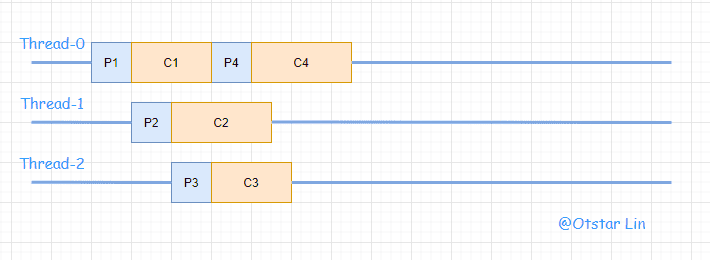

## 前言

既然说了 Tomcat 的线程池，那么这次就说说 Jetty 的任务执行策略吧。其实是 XK-Server（类似于 Tomcat 的 Java Web 容器和 HTTP 服务器）结合了二者的一些小特性，代码一两周前就写好了，这次就来水下文章。

## 什么是 EatWhatYouKill？

对于常规的 IO 操作，我们通常使用以下有几种处理方式：

**ProduceConsume：**将 IO 的生产和消费统一由**一个线程**来完成，**不断循环生产和消费的过程**。很明显，这种模式有个很严重的问题，**后面的 IO 事件要等待前面的 IO 事件完成**，这样的**效率明显很差**，越后面的 IO 事件需要等待的事件就越长。


**ProduceExecuteConsume：**采用**一个线程作为生产者**，负责收集 IO 数据流，然后将数据推送至队列中，让线程池中的**另一线程来处理数据**。这样**消费的过程就不会影响生产**，但是由于使用到了不同的线程，需要**额外消耗线程切换的性能**，同时当使用另外一个线程的时候有很大概率是调度到 CPU 的另外一个核心，这样就**无法再利用到寄存器中的热缓存**，需要再次缓存这些数据。


**ExecuteProduceConsume：**这种模式比较特殊，该模式和 ProduceConsume 类似，**都是生产消费都在一个线程里完成**，这样就可以充分的利用热缓存。但与其不同的是，**该模式可能会新建一个新线程以继续生产和执行任务**，**线程不应该生产自己不想消费的任务**，而应该**把生产和消费职责都转移到另一个进程中执行**。虽然这个可以很好的利用热缓存，但是同时也带来一个问题：**一旦 IO 的消费时间过长，就会导致大量的阻塞。**



看完上面的执行模式，你应该对 IO 的生产和消费调度有了一些理解，那么 EatWhatYouKill 又是什么呢？

**EatWhatYouKill** 是 Jetty 对 ExecuteProduceConsume 模式的改进，在**线程池空闲的时候则采用 ExecuteProduceConsume 模式**。如果**线程池处于繁忙的情况下就切换成 ProduceExecuteConsume 模式**。这么做的原因是当线程池处于繁忙的情况下，如果还是用 EPC 模式，那么就**没有空闲的线程来接受连接**（生产），这样会导致连接器（Connector）拒绝新的请求。这时候 Jetty 做了一个优化，**一旦发现线程池处于繁忙的状态，Jetty 就不会在轮询线程里消费任务，而是采用 PEC 模式**，将消费任务放到线程池中，由线程池进行调度。这样轮询线程就有办法继续接受新连接，**等到线程池不繁忙了，Jetty 就会再次切回 EPC 模式**，充分利用热缓存。

## 实现

完整的代码可以到 [Github](https://github.com/syfxlin/code/tree/master/100-days-of-code/java/src/main/java/me/ixk/days/day2) 查看。

了解了原理，那么就进入分析的阶段了，本文中的代码参考了 Jetty，对 Jetty 的 EWYK 进行简化，同时适配可扩展线程池。

首先我们需要知道，每个任务其实就是一个 `Runnable`，但直接调用 `Runnable` 的 run 方法的时候就相当于直接在本线程中执行，对应 EPC 模式。将 `Runnable` 放到线程池中执行则相当于在另外一个线程执行，对应 PEC 模式。

这样我们就可以定义以下两个方法，用于对应两种模式的执行方式：

```java
private void executeTask(final Runnable task) {
    log.info("Run task in pool");
    this.executor.execute(task);
}

private void runTask(final Runnable task) {
    log.info("Run task in loop");
    task.run();
}
```

既然有了执行的方式（消费），那么就需要有提供任务的方式（生产），此时我们可以定义一个接口来描述任务提供者：

```java
interface Producer {
    /**
     * 生产任务
     *
     * @return 任务
     */
    Runnable produce();
}
```

这样我们就有了生产和消费了，接下来就是执行策略了。

首先先定义下状态和模式：

```java
private enum State {
    /**
     * 空闲
     */
    IDLE,
    /**
     * 生产中
     */
    PRODUCING,
    /**
     * 再次生产中
     */
    REPRODUCING,
}

private enum Mode {
    /**
     * 生产-消费分离
     */
    PRODUCE_EXECUTE_CONSUME,
    /**
     * 生产-消费不分离
     */
    EXECUTE_PRODUCE_CONSUME,
}
```

然后就是实际的执行方法：

```java
@Override
public void run() {
    this.execute();
}

@Override
public void execute() {
    try (final AutoLock l = lock.lock()) {
        switch (this.state) {
            // 如果是空闲状态，则进入生产状态
            case IDLE:
                this.state = State.PRODUCING;
                break;
            // 如果是生产状态，则进入再生产状态
            case PRODUCING:
                this.state = State.REPRODUCING;
                return;
            default:
                return;
        }
    }

    // 处于运行中则轮询的执行任务
    while (this.isRunning()) {
        try {
            // 当任务被提交到其他线程执行的时候，或者当前的任务执行完毕了，则返回 true，继续执行下一个任务
            if (this.doProduce()) {
                continue;
            }
            return;
        } catch (final Throwable th) {
            log.warn("Unable to produce", th);
        }
    }
}

private boolean doProduce() {
    final Runnable task = this.produceTask();
    if (task == null) {
        // 没任务了，则进入下一个状态
        try (final AutoLock l = this.lock.lock()) {
            switch (this.state) {
                case PRODUCING:
                    this.state = State.IDLE;
                    return false;
                case REPRODUCING:
                    this.state = State.PRODUCING;
                    return true;
                default:
                    throw new IllegalStateException("State: " + this.state);
            }
        }
    }
    final Mode mode;

    try (final AutoLock l = this.lock.lock()) {
        // 尝试到线程池中执行，如果不繁忙则执行成功，进入 EPC 模式，否则进入 PEC 模式
        if (this.executor.tryExecute(this)) {
            this.state = State.IDLE;
            mode = Mode.EXECUTE_PRODUCE_CONSUME;
        } else {
            log.info("Use PEC mode");
            mode = Mode.PRODUCE_EXECUTE_CONSUME;
        }
    }

    // 按对应的模式使用不同的执行方式
    switch (mode) {
        case PRODUCE_EXECUTE_CONSUME:
            this.executeTask(task);
            return true;
        case EXECUTE_PRODUCE_CONSUME:
            this.runTask(task);
            try (final AutoLock l = this.lock.lock()) {
                if (this.state == State.IDLE) {
                    this.state = State.PRODUCING;
                    return true;
                }
            }
            return false;
        default:
            throw new IllegalStateException("State: " + this.state);
    }
}
```

## 结语

写的挺简单的，这些代码写了有一段时间了，流程忘得差不多了，所以代码就没说明的很详细。溜了溜了 😂。
