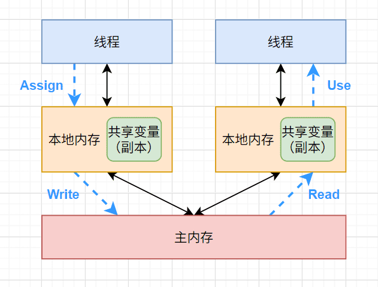

## 前言

并发编程是 Java 中重要的一部分，一直以来我对这方面的知识都只是理解，而且没有系统性，所以便打算借助写文章来整理和强化一下，所以最近浅谈系列的文章不出意外应该都是 Java 并发编程的方面了 ?。PHP 框架系列也咕了好久，看看后续有没有时间写吧 2333。

## 什么是并发？

并发是一种能并行运行多个程序或并行运行一个程序中多个部分的能力。通过充分利用多线程的特性，改善程序的性能。

## 优点 & 缺点

优点：

- 并发编程可以充分利用 CPU 资源，在多核心的情况下并行的运行程序，通常情况下并发程序花费的时间会比单线程程序更少。
- 利用并发编程我们可以很好的对业务进行拆分，并将其分配到不同的线程上。
- 在涉及 IO 操作的情况下并发通常会比同步有更好的性能。

缺点：

- 上手难度较高。
- 由于采用了多线程，所以存在着线程安全的问题。
- 在非高并发的场景下，频繁的上下文切换通常会使程序运行缓慢，甚至不如单线程。

## 一些需要知道的概念

### 进程 & 线程 & 协程

**进程即 Process**，当我们开启了一个程序，那么这一个程序就可以被称为一个进程（当然有的应用可能会有多个进程，这个就不另外说明了）。进程间的数据无法直接访问。**是操作系统分配资源的最小单位**。

**线程即 Thread**，线程是在进程之中分配的多个运行态，如果把进程比喻成火车，那么线程就是火车里面的一个个车厢。线程有各自的调用栈，同时也可以互相访问各自共享的数据。**是 CPU 调度的最小单位**。

**协程即 Coroutine**，一般也称为微线程或纤程，它的行为和线程类似，不过线程的上下文切换是通过内核态进行切换的，而协程是通过程序的调度器来进行上下文切换。不需要内核态的参与使得其拥有很好的上下文切换性能。当然一般情况下协程不会只在一个线程中跑，而是会配合多线程，然后在每个线程中开辟一些协程，非必要的情况下只需要进行用户态的切换。

### 同步 & 异步

同步指的是程序发出一个调用的时候，在**未取得返回值的时候就不返回**。即主动等待返回值。

异步指的是程序发出一个调用的时候，在**未取得返回值的时候调用者不会得到真实的返回值，而是返回一个承诺或空值**，通过回调的方式（即结果得到的时候调用传入的方法）来执行下一个任务。即被动调用。

### 阻塞 & 非阻塞

阻塞指的是当程序运行到一段耗时的代码时，**程序会卡死在那，直到执行完毕**。比如读取文件的时候，当文件的内容未读取完毕的时候，程序只能一直处于等待的状态，直到读取完毕，才能执行下一段代码，这一等待的过程称之为阻塞。

非阻塞即和阻塞相反，当程序执行到耗时的时候程序**不会等待执行完毕，而是会通过回调或再检查的方式取得返回值**。

**注意：**同步/异步 与 阻塞/非阻塞 二者并不是绑定的关系，可以有同步阻塞、异步非阻塞也可以有同步非阻塞、异步阻塞。

### 线程通信机制

由于线程间是可以进行通信的，这就衍生出了一个问题：线程间的通信机制。通常线程间的通信是通过**内存共享**或者**消息传递**。

内存共享是通过线程间读写公共的内存来达到**隐式线程间通信的机制**。而消息传递时通过发送消息来达到**显示线程间通信**。

Java 采用的是共享内存的方式来做到线程通信。

## Java 内存模型（JMM）

Java 线程间通信是通过 JMM 进行控制，JMM 决定了线程间共享的变量的写入何时对另一个线程可见。

### 结构

要了解 JMM 之前肯定是需要先看看 JMM 是什么结构的，这样也方便后续的理解。直接上图.jpg

**注意：**本地内存不是真实存在的，这是一个抽象概念，包含了缓存，寄存器等。

过程图中已经画好了，当第一个线程更改某个共享变量的时候，会先更新本地内存，然后写入到主内存，第二个线程从主内存中读取更改过的变量然后使用。

这种模式下也衍生出了一种可见性的问题，具体会在后续文章中说明。

### 重排序

重排序指的是代码的顺序和实际执行的顺序不同，之所以存在重排序是为了提高程序的性能而做的优化。

要重排序也是存在条件的，在单线程下，重排序不能改变程序运行的结果，存在数据依赖关系的时候也不允许重排序。

重排序在多线程环境下可能会导致数据不安全。

### happens-before

happens-before (先行发生于) 是 JMM 中最核心的理论，保证了内存的可见性。在 JMM 中，如果一个操作执行的结果需要对另一个操作可见，那么这两个操作之间必须存在 happens-before 关系。

如果一个操作 happens-before 另一个操作，那么第一个操作的执行结果将对第二个操作可见，而且第一个操作的执行顺序排在第二个操作之前。

两个操作之间存在 happens-before 关系，并不意味着一定要按照 happens-before 原则制定的顺序来执行。如果重排序之后的执行结果与按照 happens-before 关系来执行的结果一致，那么这种重排序并不非法。

### as-if-serial

as-if-serial 指的是所有的操作无论如何被重排序，程序的执行结果都应该和代码顺序执行的结果一致。也就是说结果不能被改变。

## 结语

总算是肝完这篇文章，连续写了两天，真的是啥都不懂 ?。写这篇文章部分是参考了一些网络文章写出来的，所以可能有很多雷同的地方，也可能会有很多错误的地方，如果您发现了文章的错误欢迎留言纠正。?
