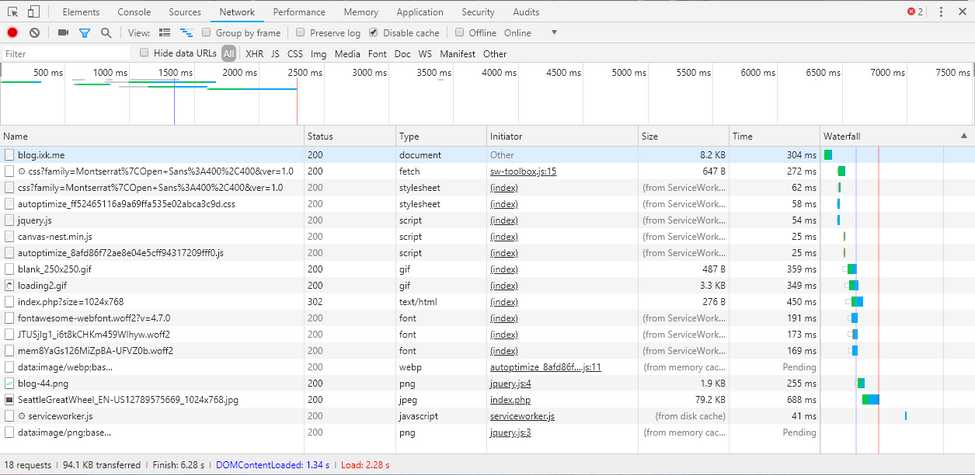

> Service Worker 是 Google 推出的一项技术。Service Worker 是浏览器在后台独立于网页运行的脚本，它打开了通向不需要网页或用户交互的功能的大门。但是对于博客来说我们只需要用到 Service Worker 缓存功能，加速网站的二次访问。



从上面的加载情况看，除去 Bing 的每日一图，其他文件共 15k，其中 gif 和 png 图都未配置 Service Worker，实际请求会更小

#### **注：**Service Workers 只有在 HTTPS 的前提下才能发挥作用

## 加入 sw-toolbox 核心至 WordPress

下载[sw-toolbox.js](https://raw.githubusercontent.com/GoogleChrome/sw-toolbox/master/sw-toolbox.js)并且放到根目录

## 创建缓存规则

在根目录下创建 serviceworker.js，并且写入下面内容（以下均为参考，具体配置请根据情况进行配置）

```javascript
"use strict";

(function () {
  "use strict";
  /**
   * Service Worker Toolbox caching
   */

  var cacheVersion = "-toolbox-v1";
  var dynamicVendorCacheName = "dynamic-vendor" + cacheVersion;
  var staticVendorCacheName = "static-vendor" + cacheVersion;
  var staticAssetsCacheName = "static-assets" + cacheVersion;
  var contentCacheName = "content" + cacheVersion;
  var maxEntries = 50;
  //以下的网址请更换为博客地址(可以填写绝对链接或者相对链接)
  self.importScripts("https://blog.ixk.me/sw-toolbox.js");
  self.toolbox.options.debug = false;
  //由于我的博客启用Autoptimize，以及WP Super Cache，所以添加Cache目录
  self.toolbox.router.get("wp-content/cache/(.*)", self.toolbox.cacheFirst, {
    cache: {
      name: staticAssetsCacheName,
      maxEntries: maxEntries,
    },
  });
  //添加毒瘤jquery的缓存规则
  self.toolbox.router.get("wp-includes/js/jquery/jquery.js", self.toolbox.cacheFirst, {
    cache: {
      name: staticAssetsCacheName,
      maxEntries: maxEntries,
    },
  });
  //添加主题的静态资源，具体目录请自行更换
  self.toolbox.router.get("/wp-content/themes/grace-minimal-theme/assets/(.*)", self.toolbox.cacheFirst, {
    cache: {
      name: staticAssetsCacheName,
      maxEntries: maxEntries,
    },
  });
  //以下均为第三方资源缓存
  self.toolbox.router.get("/(.*)", self.toolbox.cacheFirst, {
    origin: /cdn\.bootcss\.com/,
    cache: {
      name: staticVendorCacheName,
      maxEntries: maxEntries,
    },
  });

  self.toolbox.router.get("/(.*)", self.toolbox.cacheFirst, {
    origin: /static\.yecdn\.com/,
    cache: {
      name: staticVendorCacheName,
      maxEntries: maxEntries,
    },
  });

  // 缓存 googleapis
  self.toolbox.router.get("/css", self.toolbox.fastest, {
    origin: /fonts\.googleapis\.com/,
    cache: {
      name: dynamicVendorCacheName,
      maxEntries: maxEntries,
    },
  });

  self.toolbox.router.get("/css", self.toolbox.fastest, {
    origin: /fonts\.yecdn\.com/,
    cache: {
      name: dynamicVendorCacheName,
      maxEntries: maxEntries,
    },
  });

  self.toolbox.router.get("/(.*)", self.toolbox.cacheFirst, {
    origin: /(fonts\.gstatic\.com|www\.google-analytics\.com)/,
    cache: {
      name: staticVendorCacheName,
      maxEntries: maxEntries,
    },
  });

  self.toolbox.router.get("/(.*)", self.toolbox.cacheFirst, {
    origin: /(fonts-gstatic\.yecdn\.com|www\.google-analytics\.com)/,
    cache: {
      name: staticVendorCacheName,
      maxEntries: maxEntries,
    },
  });

  // immediately activate this serviceworker
  self.addEventListener("install", function (event) {
    return event.waitUntil(self.skipWaiting());
  });

  self.addEventListener("activate", function (event) {
    return event.waitUntil(self.clients.claim());
  });
})();
```

## 启用 Service Workers

打开主题文件所在目录，修改 footer.php，在 `</body>` 前加入以下代码

```html
<script>
  var serviceWorkerUri = "/serviceworker.js";

  if ("serviceWorker" in navigator) {
    navigator.serviceWorker
      .register(serviceWorkerUri)
      .then(function () {
        if (navigator.serviceWorker.controller) {
          console.log("Assets cached by the controlling service worker.");
        } else {
          console.log("Please reload this page to allow the service worker to handle network operations.");
        }
      })
      .catch(function (error) {
        console.log("ERROR: " + error);
      });
  } else {
    console.log("Service workers are not supported in the current browser.");
  }
</script>
```

以上就是 WordPress 启用 Service Worker 的方法，由于 WordPress 是动态博客所以实现断网访问有些困难，博主我很菜，所以暂时无法实现断网访问（摊手
