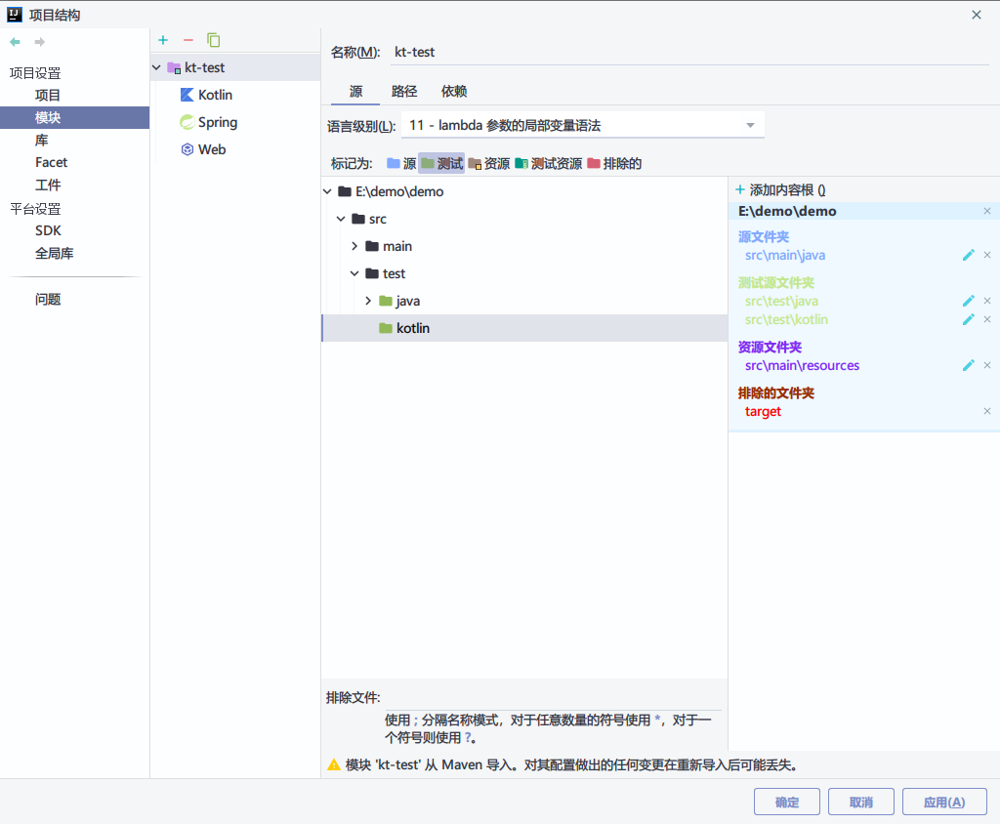

## 前言

通常情况下我们写 Spring 的项目的时候会使用 Java 语言来进行业务开发，同时使用 Java 来进行单元测试。但是 Java 由于其冗长的代码，我们在编写测试代码的效率并不高，而且我们在编写的测试代码的时候通常会考虑多种情况，代码量也就跟着急剧膨胀，带来了不小的时间浪费。最头疼的是进行 MockMvc 模拟请求测试，Java 在 15 之前都不支持多行字符串，这也就导致了我们需要一行一行的进行拼接，阅读起来非常不直观，也不能很好的利用 Intellij IDEA 的注入语言。

那么我们有什么办法可以解决这些问题呢？

## 思路

我们知道 Java 是运行在 Java 虚拟机（JVM）之上的，而 JVM 本身是语言无关的，不论上层语言是使用何种语言编写的，只要能编译成字节码文件，就能在 JVM 上运行。所以 JVM 并不只是能运行 Java 的程序。比如 Kotlin、Scala、Groovy 都可以在 JVM 上运行。除了运行不同代码外，语言之间也可以互相调用，因为代码经过编译后就与上层语言没有关系了（大家都是字节码，为什么不能一起合作呢 🤣）。

所以按照这种方式，我们就可以使用更为直观和方便的语言来编写测试代码。其中 Kotlin 与 Groovy 对 Spring 有较好的兼容性，我们可以使用这两种语言来编写测试代码（本文使用 Kotlin）。

## 实现

### 创建项目

首先，我们需要先创建一个项目（当然也可以在已有项目上修改），创建的方式就和纯 Java 项目一样创建即可。

### 配置 Maven

创建好后就可以进行配置了，我们需要配置 Maven 的依赖和插件，即 `pom.xml` 文件，按照 [Kotlin 的文档](https://kotlinlang.org/docs/maven.html)进行操作。

首先修改 `properties` 属性，同 Spring 创建后自带了一个 `java.version`，我们需要添加一个 `kotlin.version` 的属性。将版本分离出来有助于后续维护：

```xml
<properties>
  <java.version>11</java.version>
  <kotlin.version>1.5.0</kotlin.version>
</properties>
```

然后添加 Kotlin 标准库的依赖，需要注意，我们只需要在测试环境中使用 Kotlin，所以把 `scope` 定义为 `test`：

```xml
<dependency>
  <groupId>org.jetbrains.kotlin</groupId>
  <artifactId>kotlin-stdlib</artifactId>
  <version>${kotlin.version}</version>
  <scope>test</scope>
</dependency>
```

接着就是配置 Maven 插件，用于编译 Kotlin 代码，将以下的代码直接复制到 `build.plugins` 标签里即可。注意不要把 Spring 的 Maven 给删了。

```xml
<plugin>
  <groupId>org.jetbrains.kotlin</groupId>
  <artifactId>kotlin-maven-plugin</artifactId>
  <version>${kotlin.version}</version>
  <executions>
    <execution>
      <id>compile</id>
      <goals>
        <goal>compile</goal>
      </goals>
      <configuration>
        <sourceDirs>
          <sourceDir>${project.basedir}/src/main/kotlin</sourceDir>
          <sourceDir>${project.basedir}/src/main/java</sourceDir>
        </sourceDirs>
      </configuration>
    </execution>
    <execution>
      <id>test-compile</id>
      <goals>
        <goal>test-compile</goal>
      </goals>
      <configuration>
        <sourceDirs>
          <sourceDir>${project.basedir}/src/test/kotlin</sourceDir>
          <sourceDir>${project.basedir}/src/test/java</sourceDir>
        </sourceDirs>
      </configuration>
    </execution>
  </executions>
</plugin>
<plugin>
  <groupId>org.apache.maven.plugins</groupId>
  <artifactId>maven-compiler-plugin</artifactId>
  <version>3.5.1</version>
  <executions>
    <!-- Replacing default-compile as it is treated specially by maven -->
    <execution>
      <id>default-compile</id>
      <phase>none</phase>
    </execution>
    <!-- Replacing default-testCompile as it is treated specially by maven -->
    <execution>
      <id>default-testCompile</id>
      <phase>none</phase>
    </execution>
    <execution>
      <id>java-compile</id>
      <phase>compile</phase>
      <goals>
        <goal>compile</goal>
      </goals>
    </execution>
    <execution>
      <id>java-test-compile</id>
      <phase>test-compile</phase>
      <goals>
        <goal>testCompile</goal>
      </goals>
    </execution>
  </executions>
</plugin>
```

此时该项目已经具备了编译 Kotlin 的能力。但是我们还没有导入任何 Kotlin 的测试库，只使用 JUnit 的话并不方便，我们可以加一些断言库用于便捷的编写测试：

```xml
<dependency>
  <groupId>io.kotest</groupId>
  <artifactId>kotest-runner-junit5-jvm</artifactId>
  <version>4.5.0</version>
  <scope>test</scope>
</dependency>
<dependency>
  <groupId>io.kotest</groupId>
  <artifactId>kotest-assertions-core-jvm</artifactId>
  <version>4.5.0</version>
  <scope>test</scope>
</dependency>
<dependency>
  <groupId>io.kotest</groupId>
  <artifactId>kotest-assertions-json</artifactId>
  <version>4.5.0</version>
  <scope>test</scope>
</dependency>
```

Kotest 也是一个和 JUnit 类似的单元测试工具，不过我们只会用到断言的功能，因为 Kotest 虽然有 Spring 测试的支持，不过可能会遇到很多奇奇怪怪的问题（至少我是没弄好，还不如直接用 JUnit）。

### 编写业务

配置好测试环境了，我们就可以开始编写业务代码了。本文就不用实际的项目进行测试了，就随便写了一个控制器和几个函数：

```java
@RestController
public class IndexController {

    @GetMapping("/index")
    public String get() {
        return "index";
    }

    @PostMapping("/index")
    public String post(@RequestParam("value") final String value) {
        return value;
    }

    @PutMapping("/json")
    public JsonNode json(@RequestBody JsonNode node) {
        return node;
    }
}
```

```java
@Service
public class UserService {

    public String getUserName(final Long id) {
        return "username: " + id;
    }
}
```

### 编写测试

有了业务代码就可以进行测试了，首先我们需要在 `test` 文件夹里创建一个 `kotlin` 文件夹，用于存放 Kotlin 的测试代码（直接在 java 文件夹里写应该也可以，不过还是规范一点好），然后将 `kotlin` 设为测试文件夹（IDEA 不会自动识别）



用于测试 `UserService` 的代码如下：

```kotlin
@SpringBootTest
class UserServiceTest {
    @Autowired
    private lateinit var userService: UserService

    @Test
    fun getUserName() {
        userService.getUserName(1) shouldBe "username: 1"
        userService.getUserName(2) should {
            it shouldBe "username: 2"
            it.length shouldBe 11
        }
    }
}
```

可以看到 Kotlin 提供了非常多的语法糖，在测试的时候可以避免编写出不直观且重复的代码。相比之下 Java 的代码就显得有些不太直观了：

```java
@SpringBootTest
class UserServiceTest {

    @Autowired
    private UserService userService;

    @Test
    void getUserName() {
        assertEquals("username: 1", userService.getUserName(1L));
        final String userName = userService.getUserName(2L);
        assertEquals("username: 2", userName);
        assertEquals(11, userName.length());
    }
}
```

### MockMvc 测试

其实对于普通的单元测试代码是 Java 还好，但是在 MockMvc 的测试中 Kotlin 的优势就体现出来了。Spring 为 Kotlin 提供了大量的 DSL 支持：

```kotlin
@WebMvcTest(IndexController::class)
class MockMvcTest {
    @Autowired
    private lateinit var mockMvc: MockMvc

    @Test
    fun get() {
        mockMvc.get("/index").andExpect {
            status { isOk() }
            content {
                contentTypeCompatibleWith("text/plain")
                string("index")
            }
        }
    }

    @Test
    fun post() {
        mockMvc.post("/index") {
            param("value", "test value")
        }.andExpect {
            status { isOk() }
            content {
                string("test value")
            }
        }.andDo {
            print()
            handle {
                println(it.response.characterEncoding)
            }
        }
    }

    @Test
    fun json() {
        mockMvc.put("/json") {
            contentType = MediaType.APPLICATION_JSON
            accept = MediaType.APPLICATION_JSON
            content = """
                {
                  "key": "value",
                  "key2": {
                    "key3": [1, 2, 3]
                  }
                }
            """.trimIndent()
        }.andExpect {
            status { isOk() }
            content {
                contentType(MediaType.APPLICATION_JSON)
            }
            jsonPath("$.key") {
                value("value")
            }
            jsonPath("$.key2.key3.length()") {
                value(3)
            }
        }
    }
}
```

## 结语

最近都在写云笔记的项目（微服务），之后打算做成毕设，也算加个能拿得出手的项目，本文的想法也是在头疼 MockMvc 测试的 Json 请求参数实在难以阅读，突然想到的，如果你也有相关的烦恼的时候也可以试试，不过大多数开发者应该还是会使用 Java 来编写测试代码吧，毕竟更加熟悉 😂。

前不久拿到了趋势科技的暑假实习 offer，不用再担心暑假没地方实习了 🤣，只不过应该会挺晚才放假，难受 😥。可以稍微摸鱼下了，不过后面还有秋招还是要接着准备呀。
