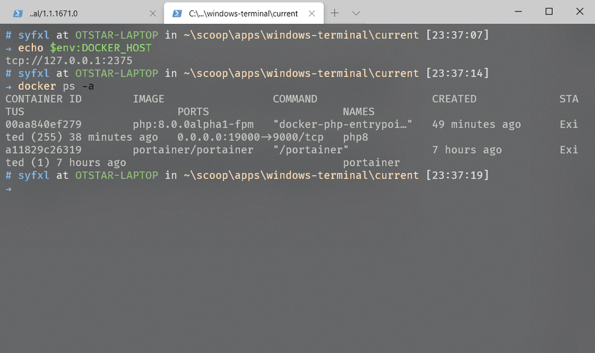
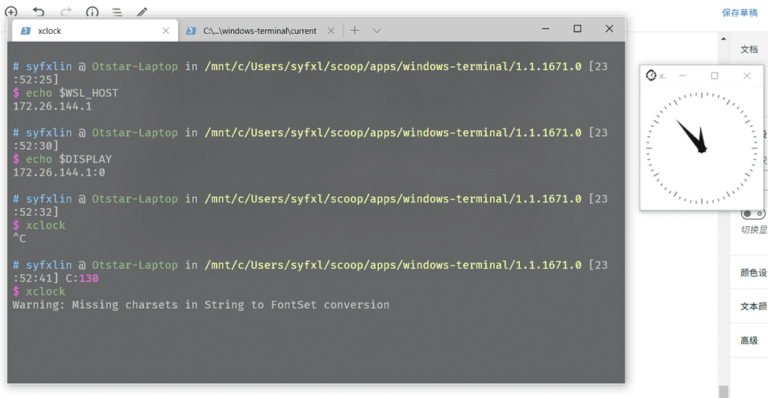
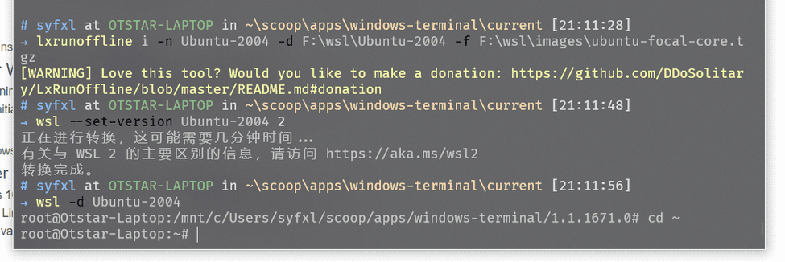

## 前言

前不久 Windows 20H1 正式推送了，我们终于可以用上 WSL2 了，博主因为是 Release 通道的 Insider，所以比其他用户早升级到 20H1，由于之前比较忙，所以一直没折腾 WSL2，直到前天考完了试，并且我之前部署的 Ubuntu 虚拟机总是出现一些问题，于是就打算试试 WSL2。

## 安装

### 准备环境

由于 WSL2 使用的是 Hyper-V 虚拟平台，所以我们需要先开启虚拟机平台，使用以下命令开启，或者也可以使用 Windows 的界面进行设置。

```powershell
Enable-WindowsOptionalFeature -Online -FeatureName VirtualMachinePlatform
```

设置完成后重启下 Windows。

### 准备发行版

重启完成后我们可以先使用 `wsl -l` 查看已经安装的 WSL 发行版。


由于 WSL2 和 WSL1 可以共存，如果你想日常继续使用 WSL1，只将 WSL2 用于 Docker 等用途的话，我建议你复制一份，然后将其转成 WSL2，就如上面的截图一样（Ubuntu 是 WSL1，Ubuntu-WSL2 是 WSL2）。

**复制 WSL 发行版的方法如下：**

首先安装 [LxRunOffline](https://github.com/DDoSolitary/LxRunOffline)，Scoop 可以使用 `scoop install lxrunoffline` 安装。其他的安装方式这里就不写了，具体请自行查看。

使用 LxRunOffline 复制的方式很简单，使用以下命令即可：

```powershell
lxrunoffline d -n <要复制的发行版> -d <复制后存储的路径> -N <复制后发行版的名>
```

当然有时候我们会使用新建的发行版来用于 WSL2，这时就可以用 LxRunOffline [导入新的发行版](https://github.com/DDoSolitary/LxRunOffline/wiki)，也可以用 Microsoft Store 安装。

### 切换 WSL 版本

有了要转换的发行版后我们就可以用以下命令将 WSL1 转换成 WSL2 了。

```powershell
wsl --set-version <发行版> <版本(1,2)>

# 设置默认创建的 WSL 版本，按需设置
wsl --set-default-version <版本(1,2)>
```

等待其切换完成，切换完成后就可以通过 `wsl -d <发行版>` 进入到 WSL 中，此时 WSL2 的安装就完成了。

## 初始化 WSL2

对于初始设置 Apt 镜像，安装基础应用，Docker，Systemd，Zsh 的脚本我已经制作好了，并发布到了 [Github](https://github.com/syfxlin/init-env) 上，你可以直接使用此脚本完成对 WSL2 的一些初始化操作。

使用此脚本安装的 Docker 已经预先**配置好了 `tcp:2375` 端口**，Windows 下只需设置 `DOCKER_HOST` 的环境变量就可以无痛使用 Docker 和 Docker-Compose，而无需安装 Docker for Windows，同时在 WSL1 中也可以通过这种方式使用 WSL2 中的 Docker（不过一般也不需要，WSL1/2 中可以直接使用 Windows 下的命令和程序。

注意: 在某些情况下，可能会出现 2375 端口处于监听状态，但是 Windows 无法连接的情况，所以博主建议使用 socat 来暴露 docker 的管理端口，具体查看 [docksal/service-socat](https://github.com/docksal/service-socat)



同时，本脚本会设置一个启动时进行一些设置的 shell 脚本，具体功能如下：

**自动设置 hosts**，由于 WSL2 中目前还无法实现使用 localhost 访问 Windows 下的服务，所以需要通过 hosts，或者 IP 来间接访问 Windows 的服务，但是由于 WSL2 的 Hyper-V 交换机在每次重启的时候都会重设 IP，这就导致了 hosts 无法设置成静态的，不然一重启就需要重新设置了。解决这个问题的方案是在每次进入 WSL2 的时候自动从 `/etc/resolved.conf` 中获取 Windows 的 IP，然后将该 IP 设置到 hosts 中，同时删除旧的 hosts。（默认设置的域名是 `h.test`）

**设置 `WSL_HOST` 环境变量**，如果不想使用 hosts 的域名，也可以使用 `WSL_HOST` 来访问 Windows。

**设置 `DISPLAY` 环境变量**，通过该环境变量，我们就可以将 Linux GUI 应用转发到 Window 下的 X Server。



**启动 systemd**，由于 WSL2 依旧是使用 init 进程，而非 systemd，所以我们无法使用 systemctl，这对 WSL2 的使用产生了很多的限制，不过我们可以通过一些手段来启动 systemd，具体见 [ubuntu-wsl2-systemd-script](https://github.com/DamionGans/ubuntu-wsl2-systemd-script)。本脚本对其进行了一些修改以适应本脚本。


## 一些使用技巧

**停止 WSL2：**`wsl --shutdown` `wsl -t <发行版>`

**备份：**`wsl --export <分发版> <文件名>`

**恢复：**`wsl --import <发行版> <安装位置> <文件名> [--version <版本>]`

**设置默认登录用户：**`lxrunoffline su -n <发行版> -v <UID>`

**卸载：**`lxrunoffline ui -n <发行版>`

**移动：**`lxrunoffline move -n <发行版> -d <路径>`

**复制：**`lxrunoffline d -n <要复制的发行版> -d <复制后存储的路径> -N <复制后发行版的名>`

Windows 目前已经可以使用 localhost 访问 WSL2 了，不过由于 Hyper-V 端口映射的一些问题，可能在 Windows 下会出现没有使用的端口也提示占用的问题并且 netcat 也未显示，这是因为 WSL2 的动态端口设置有点问题，WSL2 的动态端口是从 1024 开始映射的，可以用以下的命令调整到高一点的端口。

```powershell
netsh int ip set dynamicport tcp start=49152 num=16384
```

Docker for Windows 似乎会调整 WSL2 Hyper-V 交换机的类型，这会导致 Windows 无法使用 localhost 访问 WSL2，解决的方案是将 WSL2 的 Hyper-V 交换机调回**内部网络**

由于 Hyper-V/WSL2 的网络不属于防火墙的专用组，所以部分应用会因为防火墙的问题而无法访问 Windows 下的端口，解决方案是使用以下的命令添加防火墙规则，同时删除阻止规则。（由于 Window 防火墙阻止规则的优先级大于允许，这会导致以下设置的规则无效）

```powershell
New-NetFirewallRule -DisplayName "WSL" -Direction Inbound  -InterfaceAlias "vEthernet (WSL)"  -Action Allow
```

如果你一定需要使用静态 IP，那么也可以用以下的命令另外添加静态 IP。（重启失效）

```powershell
netsh interface ip add address "vEthernet (WSL)" 192.168.50.1 255.255.255.0
wsl -d Ubuntu-WSL2 -u root ip addr add 192.168.50.199/24 broadcast 192.168.50.255 dev eth0 label eth0:1
```

在 Windows 中要使用 WSL 中的应用我们可以创建一个 Proxy 脚本来代理调用 WSL 的应用，具体创建的方式如下，创建好后就可以用这个在 Windows 下执行该脚本，相当于在 WSL 中执行命令：

```powershell
# powershell
wsl -- docker $args

# cmd
@echo off
wsl.exe -c "docker %*"
```

在 WSL2 的 Shell 中使用 docker-compose 你可能也会遇到这个问题：

```python
Traceback (most recent call last):
  File "bin/docker-compose", line 6, in <module>
  File "compose/cli/main.py", line 72, in main
  File "compose/cli/main.py", line 128, in perform_command
  File "compose/cli/main.py", line 1078, in up
  File "compose/cli/main.py", line 1074, in up
  File "compose/project.py", line 548, in up
  File "compose/service.py", line 361, in ensure_image_exists
  File "compose/service.py", line 1250, in pull
  File "compose/progress_stream.py", line 102, in get_digest_from_pull
  File "compose/service.py", line 1215, in _do_pull
  File "site-packages/docker/api/image.py", line 396, in pull
  File "site-packages/docker/auth.py", line 48, in get_config_header
  File "site-packages/docker/auth.py", line 324, in resolve_authconfig
  File "site-packages/docker/auth.py", line 235, in resolve_authconfig
  File "site-packages/docker/auth.py", line 262, in _resolve_authconfig_credstore
  File "site-packages/docker/auth.py", line 287, in _get_store_instance
  File "site-packages/docker/credentials/store.py", line 25, in __init__
docker.credentials.errors.InitializationError: docker-credential-desktop.exe not installed or not available in PATH
[2037] Failed to execute script docker-compose
```

此时你只需要运行以下的命令即可：

```bash
rm ~/.docker/config.json
```

## 无意间发现的小特性

如果你看过 WSL 导出的系统你会发现导出的是 rootfs，而碰巧 docker 导出的容器也是 rootfs，所以理论上是可以通用的，而且 WSL 本来就可以导入 docker 的基础系统（如 Ubuntu 镜像），那么从基础系统上构建的镜像也是可以运行在 WSL 上的。

由于从 DockerHub 上拉取的是分层的镜像，所以我们需要创建成容器后再导出。

```bash
docker run -d --name nginx nginx
docker export -o /mnt/f/nginx.tar nginx
```

导出后我们就取得了 nginx 容器的 rootfs，然后通过 lxrunoffline 导入这个 rootfs 到 WSL

```bash
lxrunoffline i -n nginx -d F:\wsl\nginx -f F:\nginx.tar
wsl --set-version nginx 2 # 可选
```

导入后就可以启动了

```bash
wsl -d nginx
```

博主我稍微测试了下，运行是没有问题的，不过有可能会有坑，如果你不想在 WSL 里跑 docker 的话也可以考虑试试这个方案。

## 结语

WSL2 其实我们可以把它看成是一个轻量的虚拟机平台，介于 Docker 和 VM 间的存在，WSL2 相比于传统的 VM，它的启动速度飞快，同时占用更小，而且自动设置了端口映射和目录挂载，同时导入发行版的速度也比从头安装系统快出许多，我试过导入一个 Ubuntu Core 的镜像，并转成 WSL2，算上打字的延迟，只需要 28s。



相比 Docker 虽然差了很多，不过偶尔需要使用非 Docker 的 Linux，也不再需要等待漫长的安装了。

不过 WSL2 目前还不够完善，还有许多的问题，比如 WSL2 访问 Windows 的问题就挺难受的，还有 export import 的效率不如 VMware 和 VBox 的快照等等。

希望微软能越做越好吧，现在 WSL 已经支持 GPU 加速了，那么下一个功能会是什么呢？好奇.jpg
